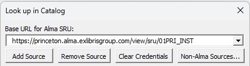
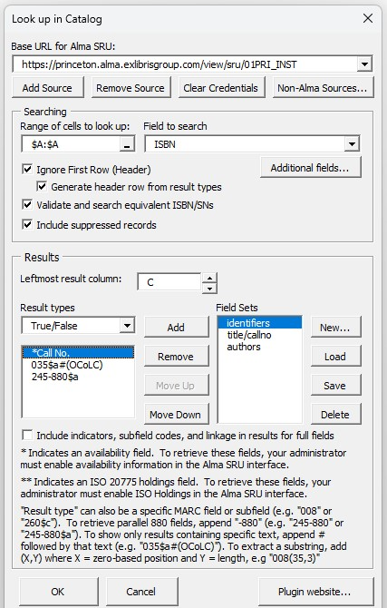
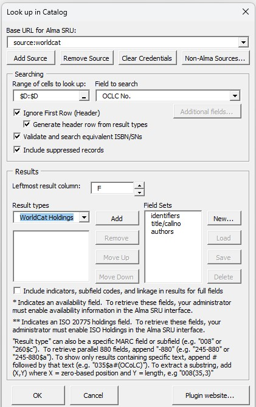
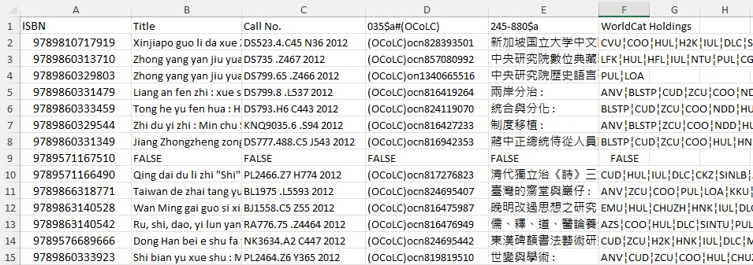

# Excel Alma Lookup
An Alma batch-search plugin designed to be used within Microsoft Excel for Windows. When integrated with your local Alma instance, the tool can perform searches by keyword, call number, title, ISBN, ISSN, MMS ID and many other fields based on the spreadsheet data. Selected non-Alma catalogs can also be searched, such as WorldCat, Library of Congress, ReCAP, and BorrowDirect.

## Installation

[Download here](https://github.com/pulibrary/ExcelAlmaLookup/releases/latest/download/CatalogLookupInstaller.exe)

Simply run the installer (and be sure to quit Excel before doing so).  If you have a previous version of the plugin installed already, it will be replaced.  After the plugin is installed, a new tab “Library Tools” will appear in the Excel ribbon.  This tab will contain a button labeled “Look Up in Catalog”. 

(Note: Depending on your computer's security settings, trying to run the installer may pop up a warning that "Windows protected Your PC".  If you receive this warning, you can proceed with the installation by clicking "More info" and then "Run anyway".  The installer is digitially signed, allowing you to verify that it is published by Princeton University.)

The plugin will only be installed under the current user's profile.  See [Configuration](#configuration) section below if you want to install the plugin for multiple users on the same computer.

## Quick Start Guide

This guide shows the basic steps involved in using this plugin. (See also the [Example](#example) section for a more detailed description of use cases involving Alma and WorldCat.) Some features require special configuration in Alma (see [Configuration](#configuration) section below).  Full documentation of the various features and options can be found further down in this README.

<ol>
 <li>Select the spreadsheet cells containing the search data, then click the "Look up in Catalog" button (see image above under <a href='#installation'>Installation</a>).</li>
 <li>Select or enter your institution's Alma SRU Base URL (or, to search WorldCat, click "Non-Alma Sources" and select "source:worldcat".)  See <a href='#configuration'>Configuration</a> section below for more information.</li>
 <li>Set the "Field name" drop-down menu to the desired search index.  The "Value" field should contain the column letter (enclosed in double brackets) of the column containing the search data, or it can contain a fixed value.  A multi-index search may be built by clicking the "Add" button below the "Value" field after each search parameter is entered. </li>
 <li>Select or enter the fields to be extracted in the "Result types" menu.  Multiple fields may be included, using the "Add" button to the right of the list.  </li>
 <li>Click "Start search" to begin the search.  If your SRU requires a username and password, a login prompt will appear. (If searching WorldCat, enter your WorldCat authorization number and password here.)  Search results for each row will appear starting in the column specified in "Leftmost result column". Another dialog will appear showing the search progress and giving you the option to stop.</li>
</ol>

## Configuration
Your local Alma instance must have an "SRU Server Type Integration Profile" enabled.  Many institutions already have this feature turned on in Alma. If yours does not, you can ask your catalog administrator to enable it, as described in the following documentation:

https://knowledge.exlibrisgroup.com/Alma/Product_Documentation/010Alma_Online_Help_(English)/090Integrations_with_External_Systems/030Resource_Management/190SRU_SRW_Search 

In order to access certain holdings fields (such as location or call number), the "Add Availability" option must be enabled for the SRU profile.  Also, in order to retrieve barcodes and other item-specific fields, "Holdings Options (ISO 20775)" must be set to "Active".  However, even without these settings enabled, the tool can retrieve any bibliographic field (and search for many types of holdings and item-related fields, including barcodes).  

The first time you run the tool, you will need to enter your institution's "Base URL for Alma SRU".  You can contact your catalog administrator to find out this URL. It typically has the form "https://[myinstitution].alma.exlibrisgroup.com/view/sru/[INSTITUTION_CODE]".  For example, the screenshot below shows the Base URL for Princeton's catalog:

After entering the URL, click “Add Source” to save the URL for future use.  One can save multiple URLs and switch between them in order to search different catalogs. If multiple URLs are saved, these can be viewed in a drop-down menu by clicking the triangular button to the right of the URL.  After selecting a URL, you can click “Remove Source” to remove it from the drop-down.  

To search a non-Alma catalog (such as WorldCat), click the "Non-Alma Sources" button.  A list of available sources will appear.  After selecting a source, it will appear in the drop-down menu along with your Alma URLs.

If your SRU integration requires a username and password, you will be prompted for these when you click "Start Search".  (These are likely different than the personal credentials you use to log into Alma.  Check with your catalog administrator.)   If searching WorldCat, you will be prompted to enter your authorization number and password. (These may be the same credentials used to log into OCLC Connexion Client.)  You can save these credentials by checking the "Remember these credentials" box in the login prompt, or delete the saved credentials by clicking the "Clear Credentials" button while the URL is selected. 

While it is not possible to automatically install the plugin for all users on a computer, you can specify a custom installation directory.  If this directory is accessible to other users on the computer, then they can enable the plugin without having to download and install it themselves.  To do so:

1. In Excel, go to the "File" tab, and click "Options" in the left sidebar.
2. In the options window, click "Add-ins" in the left sidebar. 
3. On the bottom of the window, next to "Manage", select "Excel Add-Ins", and click "Go...".
4. In the dialog that appears, click "Browse...".  Navigate to the installation directory, and select the file "CatalogLookup.xlam".  Then click "OK".
5. Click "OK" again in the Add-ins dialog, and close the options window. The "Library Tools" tab and "Look up in Catalog" button should appear, as shown above in the [Installation](#installation) section.

## Setting Up the Query
Open an Excel spreadsheet and highlight the columns/rows containing the data you want to search for in Alma.  (You can highlight specific cells, entire rows/columns, or the entire spreadsheet.)  Then, click the “Look Up in Catalog” button.  The following dialog box will appear:

See the [Configuration](#configuration) section above regarding what value to use in the "Base URL for Alma SRU" field.

### Building the Search 

A search will be performed for each visible selected row in the spreadsheet.  The search parameters can be set in the **"Search"** section of the dialog as described below: 
- **"Field name"** is the index to search in (ISBN, MMS ID, etc).  A few options are shown in the drop-down menu.  Select "Other fields..." to see a full list of available indexes.  When you select one, its field ID will appear in the menu (e.g. "alma.date_of_publication")  You can also manually type the field ID in this field once you know it.
- **"Value"** is the value to search for. If "Value" is a column letter enclosed in double-brackets (e.g. "[[A]]"), then that column is used as the source of the search value for each row.  "Value" can also be set to a fixed string, which can be useful for filtering the results.  The example above includes the parameter "alma.mms_material_type = BK" (i.e. Material Type is "Book").  When you first launch the tool, "Value" will automatically be set to the leftmost column in the selected range.
-  The **"Relation"** menu offers options for a few types of matching/comparison, based on the search index selected.  Note that "=" is a phrase search within the field, whereas "==" is an exact match of the entire field. Some fields may offer the "<>" (not equal) or "empty" options.  Numeric fields like dates may also offer "<" (greater than), ">" (less than), etc.  
- If only searching a single index, simply set "Field name", "Relation" and "Value" as desired.  Multi-index searches can be constructed by setting these options and clicking the "Add" button to add them to the list below. (The "Remove" button removes the selected parameter.)  After you add the first parameter, the leftmost menu will allow you to select "AND" or "OR" to build a Boolean query.
- In multi-index searches, the AND operator takes precendence over OR.  So, the example search above would be intepreted as `(Title = Column A AND Publication Date = Column C AND Material Type = "Book") OR (ISBN = Column B)`. However, if a cell or search value contains multiple values separated by the semicolon or vertical bar characters, the search will retrieve all records with any of those values. For example, `Title = "ABC" AND ISSN = "1234-1234; 5678-5678"` would be interpreted as `Title = "ABC" AND (ISSN = "1234-1234" OR ISSN = "5678-5678")`.

The above applies to Alma searches.  Other sources may not offer as many options, though multi-index searches are also supported for WorldCat.  Regarding WorldCat searches, please note the following:
- In the "Field Name" drop-down, there is an option "Holdings Code(s)".  This allows you to filter results to only include records with the holdings code specified in the "Value" field.  One can also set "Value" to a list of holdings codes separated by the vertical bar | character (e.g. "PUL|ZCU").  In this case, a record will be included if it is held by *any* institution in the list. Also note that rather than a boolean operator, the Holdings Code(s) index is preceded by "IF", since this is a filter applied to the search results after they are retrieved, not a parameter in the search itself. 
- The "Field Name" drop-down also has an option "Other fields...", which will display a dialog containing a list of all fields searchable in the WorldCat Z39.50 service.  (The number next to each index is the "use atttribute" value of that index, though this is not needed to contruct the search.)  See the following documentation from OCLC for details about which MARC fields correspond to each of these indexes:
https://help.oclc.org/Metadata_Services/Z3950_Cataloging/Use_Z39.50_Cataloging/Search_tips_for_OCLC_Z39.50_Cataloging .
- There is not currently an option to choose a "relation" for each part of the search, such as =, <, >, etc.  Phrase searching is used for titles, and word searching for other other indexes. However, one can manually enter a list of Bib-1 attributes in the "Field Name" box in order to override these defaults.  For example, the following string specifies an author phrase search: `@attr 4=1 @attr 1=1003`. See the following documentation from Index Data for more details about these attributes: https://software.indexdata.com/yaz/doc/bib1.html .  Feel free to ask a question in the [discussion forum](https://github.com/pulibrary/ExcelAlmaLookup/discussions) if you want to know how to perform a specific kind of search.

Other fields in the "Search" section include:

**Rows to look up**: This read-only field indicates which rows were selected before launching the tool.  If an entire column or columns were selected, then the last row containing data will automatically be detected and its row number will be shown here.

**Ignore First Row (Header)**: If checked, the first cell in the selected range will not be searched.  You should check this if the first row is a header.

**Generate header row from result types**: This option is available if the "Ignore First Row" option is checked.  For each result column, the header row will be populated with the corresponding label from the "Result Types" list.

**Validate and search equivalent ISBN/SNs**: If checked, and if “Field to search” is set to “ISBN” or “ISSN”, then each ISBN/SN will be validated.  If invalid, the value "INVALID" will be output in the result column(s). For ISBNs, the search will be done on both the 10-digit and 13-digit forms, regardless of which form is found in the spreadsheet.

**Include suppressed records**: If checked, then suppressed records will be included in the search results.

### Extracting fields for the report

The **"Results"** section of the dialog is used to indicate what should be extracted from the records that are found.  The **"Result types"** drop-down menu and the list box below show what fields will be included.  These can be specified in a few different ways:
- Selecting “True/False” will populate the result column with TRUE if records were found for that row, FALSE if not.  
- Other result types, such as call numbers and location codes, may be selected from the dropdown list.  Result types prefixed with a single asterisk are taken from the availability fields.  Those with a double asterisk are from the ISO 20775 Holdings data.  Your catalog may require special configuration to retrieve these fields.  See the [Configuration](#configuration) section above for more details.  Also, because of limitations of the SRU output, the results may not be predictable for holdings with more than 100 item records attached.
- If the search key includes a barcode, any item-level result type (those prefixed with a double asterisk) will be filtered to include only the item records corresponding to that barcode.  For other search or result types, all matching fields in the retrieved bibliographic records are included.  As noted above, this may not work as expected if a holdings record has more than 100 items attached.
- Besides the options in the menu, you can also retrieve any MARC field from the bibliographic record. To retrieve an entire MARC field, enter its 3-digit tag number (e.g. “245”).  (For institutions that include availability information in their records, this can be retrieved using the “AVA”, “AVD” or “AVE” tags.)  
- A specific subfield can be retrieved by appending “$” followed by the subfield code (e.g. “245$a”).  
- To retrieve the part of an 880 field corresponding to another field or subfield, append “-880” (e.g. “245-880” or “245-880$a”).  
- To retrieve a specific substring from a field, append "(X,Y)" where X is the starting position, and Y is the length.  For example, 008(35,3) retrieves characters 35 through 37 of field 008 (aka the language code).  Character positions are zero-based, (i.e. the first character is in position 0, the second in position 1, etc.).  This is to conform with the MARC specifications for fixed fields.  Characters can be extracted from the Leader field using "Leader(X,Y)" or "LDR(X,Y)".  If Y is set to 0, then the result will include the entire remaining part of the field starting from position X.
- To show only results containing specific text, append # followed by that text.  For example “035$a#(OCoLC)” will only retrieve 035a fields containing the text “(OCoLC)” (i.e., OCLC numbers).  Filters can also be regular expressions enclosed by slashes.  For example, "300#/^[0-9]/" retrieves all 300 fields beginning with a number.
- Multiple result types can be selected for output, in which case they will be placed in consecutive columns in the spreadsheet, starting with the one indicated in the “Leftmost result column” field.  Use the “Add”, “Remove”, “Move Up” and “Move Down” button to edit or reorder the result types.
- For some non-Alma sources, there are a limited number of result types available, and it is not possible enter a custom value in this field.  However, some sources also include a "Holdings" result type in the drop-down, which will retrieve a list of holding institutions for the item in question.

Other options in the "Results" section include:

**Leftmost result column**: The column that will be populated with the first result type.  If more than one result type is selected, the others will be put in consecutive columns to the right of the first.  By default, the first empty column to the right of the visible spreadsheet data is selected.  Use the arrow buttons to select a different column.  If the selected column contains data, it will be overwritten (except for hidden cells). Search results will be placed in the same rows as the corresponding search values.

**Max results per query**:  The number of records to extract data from for each query.  Setting this value to a lower number may result in faster searches and keep the output from becoming cluttered with redundant information.  For Alma searches, this value cannot be set higher than 50.  For WorldCat, more than 50 records may be retrieved.  Note that the WorldCat "Holdings Code(s)" parameter is a filter applied to the search results after they are retreived.  So, for example, if the max records is set to 10, and the search parameters include "Holdings Code(s) = PUL", the output will contain all PUL records within the first 10 results, rather than the first 10 PUL records.  It is probably best to set the max records to a higher value if holdings codes are an important part of the search criteria.

**Field Sets**:  Sets of field tags can be saved so that they do not need to be entered manually each time the tool is run.  After compiling a list of fields under “Result Types”, click the “New…” button to create and name a new set.  The “Load” button will populate the “Result Types” list with the fields in an existing set.  “Save” will update the fields in the selected set from the “Result types” list.  “Delete” will delete the selected set.

**Include indicators, subfield codes, and linkage in results for full fields**: If checked (and if a given result type is a full MARC field rather than a subfield), then values that are normally scrubbed out of the results are included.  The indicators will appear at the beginning of the field (a blank indicator is represented by the underscore _ character).  Each subfield will be prefixed by a dollar sign followed by the subfield code.  Also, subfield 6 containing the linkage value is included if it exists.  Note that substrings of the full field can be specified as described above.  For example, "245(0,2)" would extract the indicators (the first two characters) from field 245.  Filters may also be applied to full field, e.g. 245#10 filters the results to only include 245 fields with ind1 = 1 and ind2 = 0.

## Running the Query
After selecting or confirming the search field(s), result column(s), and the result type(s), click “Start search” to begin the lookup process.  You will see the tool populating the result column(s) with the retrieved values.  Hidden rows will be skipped.   If a record contains multiple instances of the desired result field/subfield (or, if a call number/location search is done and a record has multiple holdings/items), then all instances will be placed in the result cell, separated by “broken vertical bar” characters ¦.  If multiple bibliographic records are retrieved, the desired field from each record will be placed in the result cell, separated by solid vertical bars |.

A small dialog box will show the progress of the query.  You can terminate it at any time by clicking the "Stop Searching" button.  You do not have to keep the spreadsheet in the foreground while it is searching.  However, you may find that Excel performs more slowly in general until the search is complete. 

### Reporting Bugs and Making Suggestions

You can use the [discussion forum](https://github.com/pulibrary/ExcelAlmaLookup/discussions) or open an [issue](https://github.com/pulibrary/ExcelAlmaLookup/issues) if you would like to request features, report bugs, or ask general questions.

### Troubleshooting/Known Issues
- Some users have reported that WorldCat queries always return FALSE.  If you experience this issue, please ask your IT department to configure your firewall to allow connections to zcat.oclc.org on port 210.
- Due to restrictions on record length, WorldCat records with many holdings (more than 1700 or so) cannot be retrieved.  If you are trying to retrieve holdings codes from WC records, and a particular record is too long, a string is returned of the format `"Held/Not Held by (Your insitution code) - # other holdings"`.  There is no issue with retrieving other bibliographic information from WorldCat.

## Example
This example illustrates a typical use case.  The user starts with a title list containing ISBNs and titles.  

They would like to search their institution's Alma catalog to confirm which items are owned by their instituion, and retrieve additional data for those items.  Since ISBNs are a more reliable search key than titles, the user highlights column A contianing the ISBNs, then clicks the "Look Up in Catalog" button in the "Library Tools" tab.  This brings up the following dialog:

The user sets "Field Name" to "ISBN".  The "Value" field already contains the selected column ([[A]]), so it is not necessary to change this field.  (Since the user is only searching for a single index, it is also not necessary to build a complex search by clicking "Add".)  The leftmost result column is also already set to C, which is the first blank column to the right of the data.  The user also sets 3 result types: MMS ID, 300$a, and 008(7,4).  (This last parameter refers to the "Date 1" value found in positions 7-10 of field 008.) The user then clicks OK.  The screenshot below shows the resulting spreadsheet:

(To save space, the columns are not displayed at full width.)

For each row of the spreadsheet, the three data elements mentioned above are output in columns C, D, and E respectively. Since the user selected the option to generate column headers, these appear in the first row.  If more than one record was retrieved for an ISBN, then a vertical bar  is used to separate data from different records.  (This can be seen in rows 7 and 9.)  Since the ISBN in row 12 was not found in the catalog, the value FALSE is output in each of these columns.

The user is now interested in seeing if WorldCat has any records for these items that are cataloged by the Library of Congress, even if the ISBN is missing or different than what is in column A.  After highlighting columns B through E, they launch the tool again, and configure it as shown in the screenshot below.

This time, they use the "Non-Alma Sources" button to set the source to "source:worldcat".  (If they have done this in the past, then it would already appear in the drop-down list of sources.) They contstruct a Boolean search that includes Title = Column B, Year of Publication = Column E, and the Cataloging Source =  "DLC". (This last parameter can be found by selecting "Additional fields..." from the "Field name" drop-down.) They also select "OCLC No." and "WorldCat Holdings" as result types.

When the user clicks the "OK" button, they will be prompted to enter their WorldCat authorization number and password (unless they have entered it before and selected the option to save the login.)  Then, the tool looks up each OCLC number in WorldCat, and populates column F and G with a list of OCLC numbers and holdings codes as shown below.

(Columns C and D are hidden in this screenshot.)

 As before, the data from each record is separated by a solid vertical bar.  The list of holdings codes within a particular record is delimited with the broken vertical bar character.  If records were not found in WorldCat that matched the criteria for a given row, then FALSE is output in columns F and G of that row.
