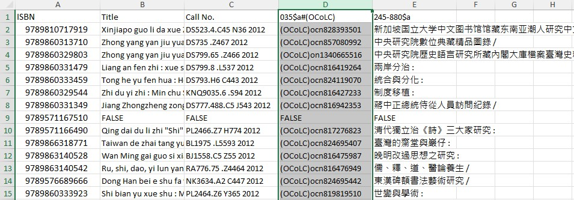

# Excel Alma Lookup
An Alma batch-search plugin designed to be used within Excel. When integrated with your local Alma instance, the tool can perform searches by keyword, call number, title, ISBN, ISSN, MMS ID and many other fields based on the spreadsheet data. Selected non-Alma catalogs can also be searched, such as WorldCat, Library of Congress, ReCAP, and IPLC ReShare.

## System Requirements
- Microsoft Windows version 7 or higher
- Microsoft Excel version 2007 or higher

## Installation

Download the installer here:

<a href="https://github.com/pulibrary/ExcelAlmaLookup/releases/latest/download/CatalogLookupInstaller.exe">CatalogLookupInstaller.exe</a>

Simply run the installer as the user who will be using the plugin (and be sure to quit Excel before doing so).  After the plugin is installed, a new tab “Library Tools” will appear in the Excel ribbon.  This tab will contain a button labeled “Look Up in Catalog”. 

(Note: Depending on your computer's security settings, trying to run the installer may pop up a warning that "Windows protected Your PC".  If you receive this warning, you can proceed with the installation by clicking "More info" and then "Run anyway".)

## Configuration
Your local Alma instance must have an "SRU Server Type Integration Profile" enabled.  Many institutions already have this feature turned on in Alma. If yours does not, you can ask your catalog administrator to enable it, as described in the following documentation:

https://knowledge.exlibrisgroup.com/Alma/Product_Documentation/010Alma_Online_Help_(English)/090Integrations_with_External_Systems/030Resource_Management/190SRU_SRW_Search 

In order to access certain holdings fields (such as location or call number), the "Add Availability" option must be enabled for the SRU profile.  Also, in order to retrieve barcodes and other item-specific fields, "Holdings Options (ISO 20775)" must be set to "Active".  However, even without these settings enabled, the tool can retrieve any bibliographic field (and search for many types of holdings and item-related fields, including barcodes).  

The first time you run the tool, you will need to enter your institution's "Base URL for Alma SRU".  You can contact your catalog administrator to find out this URL. It typically has the form "https://[myinstitution].alma.exlibrisgroup.com/view/sru/[INSTITUTION_CODE]".  For example, the screenshot below shows the Base URL for Princeton's catalog:

After entering the URL, click “Add URL to List” to save the URL for future use.  One can save multiple URLs and switch between them in order to search different catalogs. If multiple URLs are saved, these can be viewed in a drop-down menu by clicking the triangular button to the right of the URL.  After selecting a URL, you can click “Remove URL from List” to remove it from the drop-down.  

To search a non-Alma catalog (such as WorldCat), click the "Non-Alma Sources" button.  A list of available sources will appear.  After selecting a source, it will appear in the drop-down menu along with your Alma URLs.

If your SRU integration requires a username and password, you will be prompted for these.  (These are likely different than the personal credentials you use to log into Alma.  Check with your catalog administrator.)   If searching WorldCat, you will be prompted to enter your authorization number and password.  You can save these credentials by checking the "Remember these credentials" box in the login prompt, or delete the saved credentials by clicking the "Clear Credentials" button while the URL is selected. 

## Setting up the query
Open an Excel spreadsheet and highlight the cells containing the data you want to search for in Alma.  You can highlight an entire column, or just specific cells, but all the values should be contained in the same column.  After highlighting the desired cells, click the “Look Up in Local Catalog” button.  The following dialog box will appear:

Below is an explanation of the fields in this dialog:

**Base URL for Alma SRU**:  See the "Configuration" section above.  

**Select a range of cells to look up**: This field indicates which cells contain the values you want to search for.  If you selected a range of cells before clicking the button, then this field will already contain the appropriate value.  However, it is possible to select a new range of cells by clicking the button to the right of this field.  Please note that hidden cells in the indicated range will not be included in the search.

**Ignore First Row (Header)**: If checked, the first cell in the selected range will not be searched.  You should check this if the first row is a header.

**Generate header row from result types**: This option is avialable if the "Ignore First Row" option is checked.  For each result column, the header row will be populated with the corresponding label from the "Result Types" list.

**Validate and search equivalent ISBN/SNs**: If checked, and if “Field to search” is set to “ISBN” or “ISSN”, then each ISBN/SN will be validated.  If invalid, the value "INVALID" will be output in the result column(s). For ISBNs, the search will be done on both the 10-digit and 13-digit forms, regardless of which form is found in the spreadsheet.

**Include suppressed records**: If checked, then suppressed records will be included in the search results.

**Leftmost result column**: The column that will be populated with the first result type.  If more than one result type is selected, the others will be put in consecutive columns to the right of the first.  By default, the first empty column to the right of the visible spreadsheet data is selected.  Use the arrow buttons to select a different column.  If the selected column contains data, it will be overwritten (except for hidden cells). Search results will be placed in the same rows as the corresponding search values.

**Field to search**: This indicates what kind of values are in the selected cells (e.g. ISBN, ISSN, Call Number, Title, or MMS ID).  If an ISBN search is done, then spaces, dashes and parenthetical comments (e.g. “(paperback)”) are removed from the value before searching.  Currently, the title search does not strip stopwords or do anything else to “clean up” the titles before searching.  Thus, title searching will not be as accurate as the other search types.  Also, please note that the search term will be treated as a phrase and enclosed in quotes, even if it contains multiple words.

Besides the search keys in the drop-down list, you can enter any search index supported by the local Alma instance.  Clicking the “Additional Fields” button will display a full list of such keys.  Selecting an index from this list will enter the appropriate code in “Field to Search”.  Note that for non-Alma sources, only a limited number of search types are available, and the "Additional Fields" button is not enabled.

**Result types**:   The type of data to retrieve from the records and output in the spreadsheet.  Result types can be specified in a number of different ways: 
- Selecting “True/False” will populate the result column with TRUE and FALSE values based on whether the search values were found in the catalog.  
- Other result types, such as call numbers and location codes, may be selected from the dropdown list.  Result types prefixed with a single asterisk are taken from the availability fields.  Those with a double asterisk are from the ISO 20775 Holdings data.  Your catalog may require special configuration to retrieve these fields.  See the "Configuration" section above for more details.  Also, because of limitations of the SRU output, the results may not be predictable for holdings with more than 100 item records attached.
- If the search key is a barcode, any item-level result type (those prefixed with a double asterisk) will be filtered to include only the item records corresponding to that barcode.  For other search or result types, all matching fields in the retrieved bibliographic records are included.  As noted above, this may not work as expected if a holdings has more than 100 items attached.
- Besides the options in the menu, you can also retrieve any MARC field from the bibliographic record. To retrieve an entire MARC field, enter its 3-digit tag number (e.g. “245”).  (For institutions that include availability information in their records, this can be retrieved using the “AVA”, “AVD” or “AVE” tags.)  
- By default, some text is removed from the field, such as indicators, subfield tags, and the contents of subfield 6 (linkage).  To retain this information in the output, check the option "Include indicators, subfield codes, and linkage in results for full fields". 
- A subfield can be retrieved by appending “$” followed by the subfield code (e.g. “245$a”).  
- To retrieve the part of an 880 field corresponding to another field or subfield, append “-880” (e.g. “245-880” or “245-880$a”).  
- To retrieve a specific substring from a field, append "(X,Y)" where X is the starting position, and Y is the length.  For example, 008(35,3) retrieves characters 35 through 37 of field 008 (aka the language code).  Character positions are zero-based, (i.e. the first character is in position 0, the second in position 1, etc.).  This is to conform with the MARC specifications for fixed fields.  Characters can be extracted from the Leader field using "Leader(X,Y)" or "LDR(X,Y)".  If Y is set to 0, then the result will include the entire remaining part of the field starting from position X.
- To show only results containing specific text, append # followed by that text.  For example “035$a#(OCoLC)” will only retrieve 035a fields containing the text “(OCoLC)” (i.e., OCLC numbers).  
- Multiple result types can be selected for output, in which case they will be placed in consecutive columns in the spreadsheet, starting with the one indicated in the “Leftmost result column” field.  Use the “Add”, “Remove”, “Move Up” and “Move Down” button to edit or reorder the result types.
- For some non-Alma sources, there are a limited number of result types available, and it is not possible enter a custom value in this field.  However, some sources also include a "Holdings" result type in the drop-down, which will retrieve a list of holding institutions for the item in question.

Note that this tool is designed for running queries on lists of specific titles and identifiers, rather than more general queries that might return a large number of results.  Thus, to improve performance, a maximum of 25 records will be retreived for each row.

**Field Sets**:  Sets of field tags can be saved so that they do not need to be entered manually each time the tool is run.  After compiling a list of fields under “Result Types”, click the “New…” button to create and name a new set.  The “Load” button will populate the “Result Types” list with the fields in an existing set.  “Save” will update the fields in the selected set from the “Result types” list.  “Delete” will delete the selected set.

**Include indicators, subfield codes, and linkage in results for full fields**: If checked (and if a given result type is a full MARC field rather than a subfield), then values that are normally scrubbed out of the results are included.  The indicators will appear at the beginning of the field (a blank indicator is represented by the underscore _ character).  Each subfield will be prefixed by a dollar sign followed by the subfield code.  Also, subfield 6 containing the linkage value will be included if it exists.  Note that substrings of the full field can be specified as described above.  For example, "245(0,1)" would extract the indicators (the first two characters) from field 245.

## Running the Query
After selecting or confirming the range of cells to look up, the field to search, and the result type(s), click “OK” to begin the lookup process.  You will see the tool populating the result column(s) with the retrieved values.  Hidden rows will be skipped.   If a record contains multiple instances of the desired result field/subfield (or, if a call number/location search is done and a record has multiple holdings/items), then all instances will be placed in the result cell, separated by “broken vertical bar” characters (¦).  If multiple bibliographic records are retrieved by a single search value, the desired field from each record will be placed in the result cell, separated by solid vertical bars (|).

A small dialog box will show the progress of the query.  You can terminate it at any time by clicking the "Stop Searching" button.  You do not have to keep the spreadsheet in the foreground while it is searching.  However, you may find that Excel performs more slowly in general until the search is complete. 

### Reporting Bugs and Making Suggestions

If you encounter any problems with this tool or would like to request new features, please go to the "Issues" tab at the top of this github page, and click the "New Issue" button. 

## Example
This example illustrates a typical use case.  The user starts with a title list containing ISBNs and romanized titles for a set of Chinese books.   

They would like to search the catalog to confirm which items are owned by their instituion, and retrieve additional data for those items.  Since ISBNs are a more reliable search key than titles, the user highlights column A contianing the ISBNs, then clicks the "Look Up in Local Catalog" button in the "Library Tools" tab.  This brings up the following dialog:

The "Range of cells to lookup up" field already shows the cells that the user hightlighted (in this case, the entire column A).  So, it is not necessary to change this field.  The user sets "Field to Search" to "ISBN".  The leftmost result column is also already set to C, which is the first blank column to the right of the data.  The user also sets 3 result types: 
- Call number - The asterisk indicates that this will be retrieved from the availability fields.  (If the user wanted to retrieve the call number from a bibliographic field, they could enter a specific MARC field name, such as 050 or 084).
- 035$a#(OCoLC) - This retrieves all instances of 035$a containing the text "(OCoLC)", i.e. OCLC numbers.
- 245-880$a - This retrieves all instances of 880$a that are linked to the 245 field, i.e. the original-script version of the Chinese titles.

The user then clicks OK.  The screenshot below shows the resulting spreadsheet:

For each row of the spreadsheet, the three data elements mentioned above are output in columns C, D, and E respectively. Since the ISBN in row 9 was not found in the catalog, the value FALSE is output in each of these columns.
