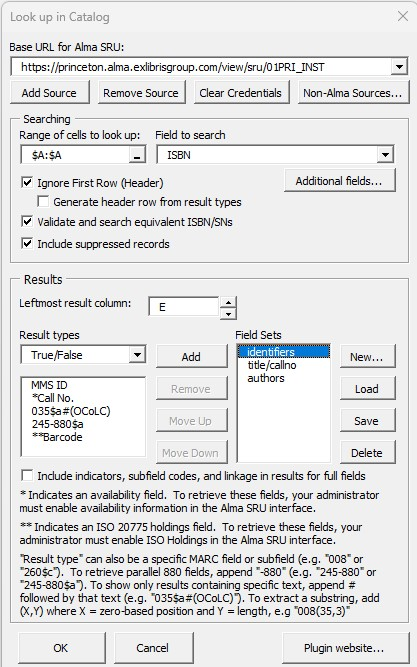

# ExcelAlmaLookup
An Excel VBA plugin for performing Alma catalog lookups

## System Requirements
- Microsoft Windows version 7 or higher
- Microsoft Excel version 2007 or higher
- Your local Alma instance must have an "SRU Server Type Integration Profile" enabled.  Many institutions already have this feature turned on in Alma. If yours does not, you can ask your catalog administrator to enable it, as described in the following documentation:

https://knowledge.exlibrisgroup.com/Alma/Product_Documentation/010Alma_Online_Help_(English)/090Integrations_with_External_Systems/030Resource_Management/190SRU_SRW_Search 

In order to access certain holdings fields (such as location or call number), the "Add Availability" option must be enabled for the SRU profile.  However, even without it enabled, the tool can retrieve any bibliographic field.  The tool does not currently support accessing the catalog if a username and password are required. 

## Installation

Download there installer here:

<a href="https://github.com/pulibrary/ExcelAlmaLookup/releases/latest/download/CatalogLookupInstaller.exe">CatalogLookupInstaller.exe</a>

To install the “Look up in Local Catalog” plugin, simply run the installer as the user who will be using the plugin (be sure to quit Excel before doing so).  After the plugin is installed, a new tab “Library Tools” will appear in the ribbon.  This tab will contain a button labeled “Look Up in Local Catalog”.  

## Setting up the query
Before clicking the button, highlight the cells containing the values you want to search for.  You can highlight an entire column, or just specific cells.  But all the values should be contained in the same column.  After highlighting the desired cells, click the “Look Up in Local Catalog” button.  The following dialog box will appear:

Below is an explanation of the fields in this dialog:

**Base URL for Alma SRU**:  Contact your catalog administrator to get this URL.  It typically has the form https://[myinstitution].alma.exlibrisgroup.com/view/sru/[INSTITUTION_CODE].  After entering a URL, click “Add URL to List” to save the URL in the drop-down list for future use.  After selecting a URL, you can click “Remove URL from List” to remove it from the drop-down.

**Select a range of cells to look up**: This field indicates which cells contain the values to be searched.  If you selected a range of cells before clicking the button, then this field will already contain the appropriate value.  However, it is possible to select a new range of cells by clicking the button to the right of this field.  Please note that hidden cells in the indicated range will not be included in the search.

**Ignore First Row (Header)**: If checked, the first cell in the selected range will not be searched, and no other cells in that row will be overwritten.  You should check this if the first row is a header.

**Validate and search equivalent ISBN/SNs**: If checked, and if “Field to search” is set to “ISBN” or “ISSN”, then each ISBN/SN will be validated.  If invalid, the check digit will be recalculated before searching. For ISBNs, the search will be done on both the 10-digit and 13-digit forms, regardless of which form is found in the spreadsheet.

**Include suppressed records**: If checked, then suppressed records will be included in the search results.

**Leftmost result column**: The column that will be populated with the first result type.  If more than one result type is selected, the others will be put in consecutive columns to the right of the first.  By default, the first empty column to the right of the visible spreadsheet data is selected.  Use the arrow buttons to select a different column.  If the selected column contains data, it will be overwritten (except for hidden cells). Search results will be placed in the same rows as the corresponding search values.

**Field to search**: This indicates what kind of values are in the selected cells (e.g. ISBN, ISSN, Call Number, Title, or MMS ID).  If an ISBN search is done, then spaces, dashes and parenthetical comments (e.g. “(paperback)”) are removed from the value before searching.  Currently, the title search does not strip stopwords or do anything else to “clean up” the titles before searching.  Thus, title searching will not be as accurate as the other search types.

Besides the search keys in the drop-down list, you can enter any search index supported by the Alma SRU.  Clicking the “Additional Fields” button will display a full list of such keys.  Selecting an index from this list will enter the appropriate code in “Field to Search”.

**Result types**:  The type of data to retrieve from the records that are found.  Selecting “True/False” will populate the column with TRUE and FALSE values based on whether the search values were found in the catalog.  The menu includes other result types, such as call numbers and location codes.  Besides the options in the menu, you can also retrieve any field from the bib record. To retrieve an entire MARC field, enter its 3-digit tag number (e.g. “245”).  (For institutions that include availability information in their records, this can be retrieved using the “AVA”, “AVD” or “AVE” tags.)  A subfield can be retrieved by appending “$” followed by the subfield code (e.g. “245$a”).  To retrieve the part of an 880 field corresponding to another field or subfield, append “-880” (e.g. “245-880” or “245-880$a”).  To show only results containing specific text, append # followed by that text.  For example “035$a#(OCoLC)” will only retrieve 035a fields containing the text “(OCoLC)” (i.e., OCLC numbers).  Subfield tags will be removed from the result before writing it to the spreadsheet.  Multiple result types can be selected, in which case they will be placed in consecutive columns in the spreadsheet, starting with the one indicated in the “Leftmost result column” field.  Use the “Add”, “Remove”, “Move Up” and “Move Down” button to edit or reorder the result types.

Note that this tool is designed for running queries on lists of specific titles and identifiers, rather than more general queries that might return a large number of results.  Thus, to improve performance, a maximum of 10 records will be retreived for each row.

**Field Sets**:  Sets of field tags can be saved so that they do not need to be entered manually each time the tool is run.  After compiling a list of fields under “Result Types”, click the “New…” button to create and name a new set.  The “Load” button will populate the “Result Types” list with the fields in an existing set.  “Save” will update the fields in the selected set from the “Result types” list.  “Delete” will delete the selected set.

## Running the Query

Click “OK” to begin the lookup process.  You will see the tool populating the result column(s) with the retrieved values.  Hidden rows will be skipped.   If a record contains multiple instances of the desired result field/subfield (or, if a call number/location search is done and a record has multiple holdings), then all instances will be placed in the result cell, separated by “broken vertical bar” characters (¦).  If multiple bib records are retrieved by a single search value, the desired field from each record will be placed in the result cell, separated by solid vertical bars (|).

A small dialog box will show the progress of the query.  You can terminate it at any time by clicking the "Stop Searching" button.
